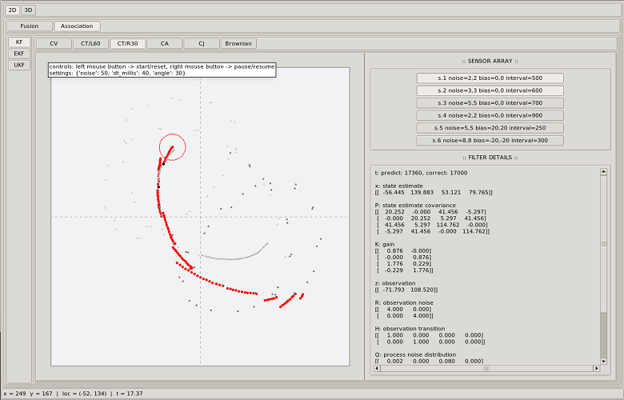

# Bayesian filters, motion models, sensor fusion

This repository contains a virtual testbed for sensor fusion and multi-sensor tracking using standard motion models and recursive Bayesian filters. The mouse cursor moving on-screen provides both the target to be tracked and the ground truth for all noisy measurements.

## Details

The graphical user interface got several views to show different combinations of Kalman filters and motion models either in 2D or 3D space. Various sensors are available in each view with both different error configurations for noise (Gaussian distributed) and bias (constant offset) and sampling rate. All measurements are forwarded to the selected filter by a simple event system emulating a packet-based network for transport. The actual mouse position in the canvas provides the position of a target for input to all active sensors.

The following features are implemented:

- Motion models
    - 2D: Constant Velocity (CV), Coordinate Turn (CT), Constant Acceleration (CA), Constant Jerk (CJ), Constant Turn Rate Velocity (CTRV), Constant Turn Rate Acceleration (CTRA)
    - 3D: Constant Velocity (CV), Constant Yaw Rate Pitch Rate Velocity (CYRPRV), Constant Acceleration (CA), Constant Yaw Rate Pitch Rate Acceleration (CYRPRA), Constant Jerk (CJ)
- Filters
    - Kalman filter (KF)
    - Extended Kalman filter (EKF)
    - Unscented Kalman filter (UKF)

For 3D tracking, a third coordinate (z) for the actual position is simply determined from the x and y coordinate. All views for sensor association generate a fake target by the change of sign of x and y of the actual position.

## Usage

To start or reset the simulation press the left mouse button on a canvas, to pause or resume the simulation press the right mouse button.
The path (ground truth) of the mouse cursor (target) is shown by a gray trace. The estimates of the filter are shown by red dots, the uncertainty of estimation is shown by a red circle or ellipse respectively.
Sensors can be activated or deactivated at any time.

## Requirements

- Python 3
- tkinter
- numpy

## References

- R. E. Kalman -- [A New Approach to Linear Filtering and Prediction Problems](http://fluidsengineering.asmedigitalcollection.asme.org/article.aspx?articleid=1430402)
- R. Schubert, E. Richter, G. Wanielik -- [Comparison and evaluation of advanced motion models for vehicle tracking](https://ieeexplore.ieee.org/abstract/document/4632283/)